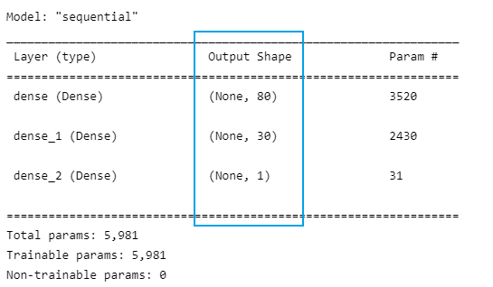
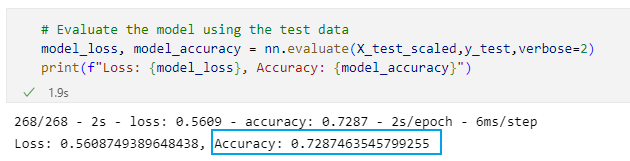
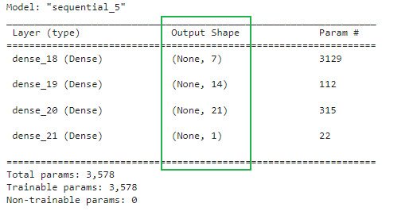

# Alphabet Soup Charity Neural Network Analysis

## Overview
The purpose of this analysis is to use a neural network to decide which companies should recieve loans from Alphabet Soup. This analysis uses python's TensorFlow library to create, train, and evaluate data gathered from previous loans.

## Results
### Data Preprocessing
After looking at the data, I recognized that the target variable is the "IS_SUCCESSFUL" column. First I removed the "EIN" and "NAME" columns because I considered they did not offer any relevant data that could help the model perform better. The remaining columns became the features for the model.

### Compiling, Training, and Evaluating the Model
For my first attempt at compiling a neuron network consisted of 80 neurons in the first layer and 30 in the second. Both layers had relu activation functions and the output layer had a sigmoid activation function. I started with these parameters as relu does better with nonlinear data, and two layers allows for a second layer to reweight the inputs from the first layer. 

Here are the preformance metrics of this model, the accuracy rate is only 72.9%.

### Optimisation
In optimisation, I add back the "NAME" column. I changed the first layer from 80 to 7 neurons, the second layer from 30 to 14 neurons, also added a third layer with 21 neurons apart of it. By adding a third layer, I wanted to give the model another chance to reweight the inputs from the second layer to the third. 

Here are the preformance metrics of this model, the accuracy rate more than 75%.

### Summary
From the analysis, it is evident the deep neural network machine learning model produced a moderately useful binary classifier in predicting whether loaning to a given applicant will produce successful results. The predictive capability pass over 75% accuracy rate after additional optimization tests. Keeping the "Name" column was crucial in achieving and going beyond the target. This shows the importance of the shape of your datasets before you preprocess it.
